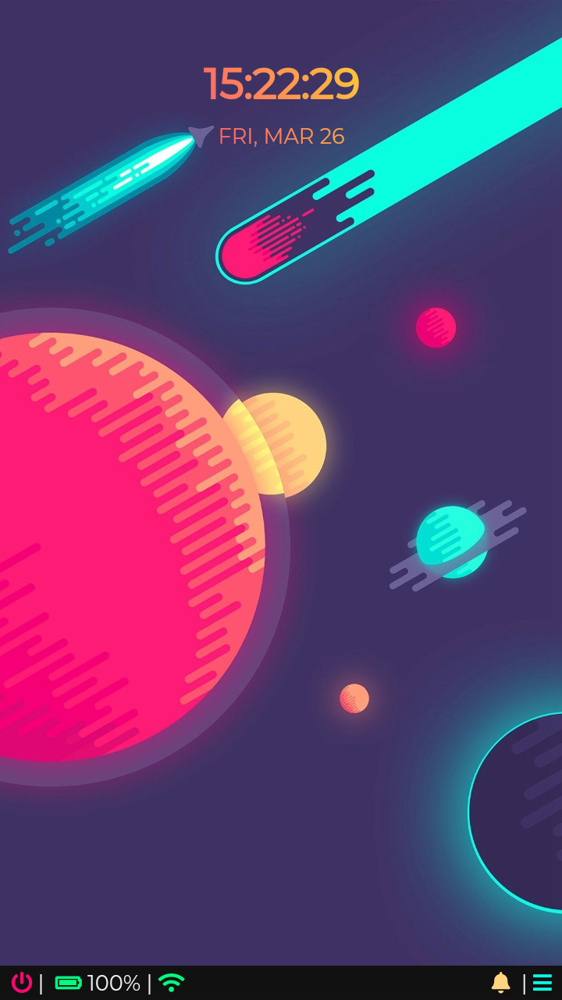

# Deep

Desktop environment like web design. Made with SASS and Vue.


## Local setup

```bash
yarn global add typecript
yarn global add sass
yarn build
# alternatively:
# build JS files for prod: yarn build:js
# build CSS files for prod: yarn build:css
```

## Preview

This is how it looks right now:



*My first project with SASS and Vue.*